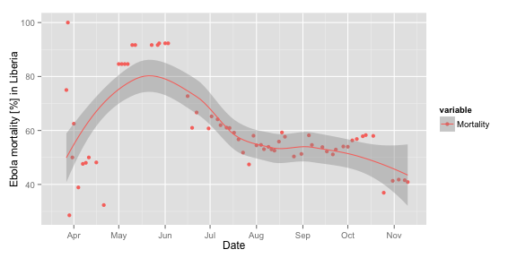

## Ebola in West Africa: A Shiny app

This Shiny app plots time series of reported Ebola cases and deaths in the three West African countries mostly affected by the pandemic, namely Guinea, Liberia, and Sierra Leone, with the user being able to pick the country being plotted. It also calculates and graphs mortality rates for the picked country, and adds a loess smoother.

The app can be found at [ShinyApps](https://mkuentzler.shinyapps.io/shiny_ebola/), and the source code at [Github](https://github.com/mkuentzler/shiny_ebola).

--- .class #id 

## Data source

The data used is sourced from

[github.com/cmrivers/ebola/blob/master/country_timeseries.csv](https://github.com/cmrivers/ebola/blob/master/country_timeseries.csv),

which in turn comes from the World Health Organisation's [Disease Outbreak News](http://www.who.int/csr/don/en/) and [Situation Reports](http://www.who.int/csr/disease/ebola/situation-reports/en/). In the Github repository above, data from other sources, such as the Liberia, Sierra Leone, and Guinea Ministries of Health, can also be found.

---

## Data preprocessing

- Preprocessing steps are relatively minor: The relevant variables (case and death counts for Guinea, Liberia, and Sierra Leone) are selected from the input data, dates are converted to Datetime format, and the data frames are rearranged for ggplotting (cf. the code lines 5-45 in [server.R](https://github.com/mkuentzler/shiny_ebola/blob/master/Ebola_App/server.R)).
- Mortality rates are calculated by dividing the accumulated reported deaths by the accumulated reported cases, if both of these are known on a given date. Therefore, the shown mortality rates are accumulated as well.

---

## Plots

- Plots are dynamically generated for the chosen country using ggplot2. Points from the source are plotted and overlaid with a loess smoother.
- Exemplary mortality plot (for Liberia):
 

---

## Shiny wrapper

Finally, the Shiny app itself is fairly basic: Three radio buttons in the side panel select the country for which death and case counts as well as mortality rates are displayed in the main panel. Plots are dynamically updated upon reselection.
